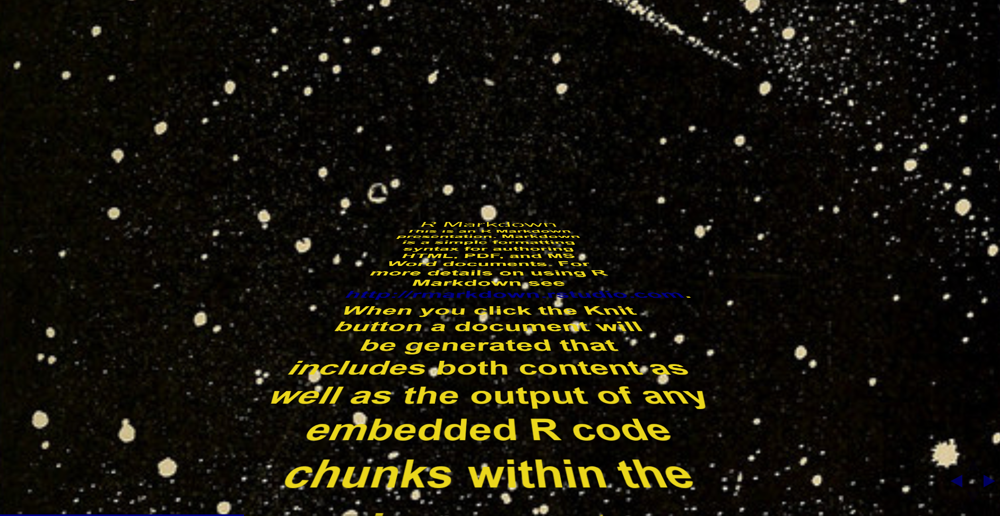
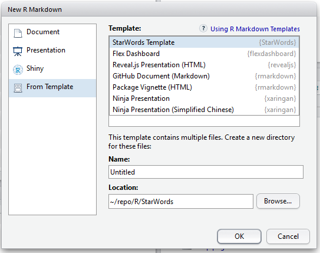

StarWords
=========

An R Markdown template for Star-Wars-intro-like presentation using [StarWarsIntro.css](https://polarnotion.github.io/starwarsintro/)

Example
-------

https://yutannihilation.github.io/StarWords/Untitled.html




Installation
------------

```r
devtools::install_github("yutannihilation/StarWords")
```

Usage
-----

Choose StarWords template and create a new Rmd.



Knit it.
